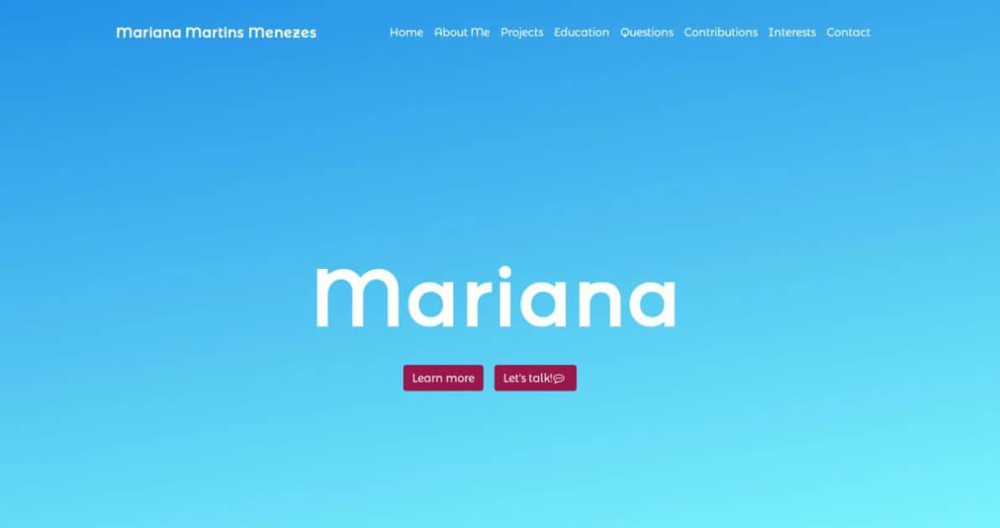

Mariana Menezes Portfolio
=========================



## Introduction
This is my personal website. 
It contains relevant projects, 
my articles and some questions about me. 

## How to Run

Before running, you need to install all dependencies using the
following command line:

```
npm install
```

Then, you can run this project using the following command line:

```
npm run start
```

It will start a webserver at port `8080`, which reloads automatically
if there're changes on the source code.

If you want to generate all files to deploy on production, use the
following command line:

```
npm run build
```

It will generate the whole application on `dist` folder.  `index.html`
is the main html file.  You can use this application in a static file
server.  Currently, this application runs in production through
_Github Pages_.


## Technologies

I have used the following technologies/methodologies/frameworks to build my website:

* HTML5
* CSS3
* Font Awesome
* Sass
* Bootstrap 4.0
* JavaScript
* jQuery
* Webpack
* Marko.js
* WAI-ARIA 1.0
* WCAG 2.0
* Github-Calendar
* CSS3 Animate It
* Hover.css

## Content

The following list shows all sections available on this website.

* About Me
* Projects
* Education
* Some questions about me
* My contributions on GitHub
* Musics / Books / Medium Articles
* Contact

